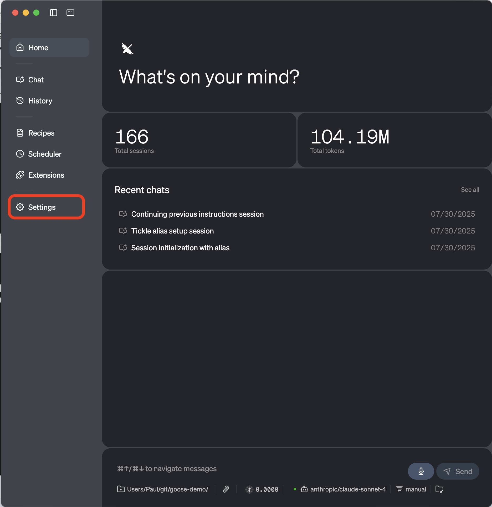

# AlphaZero Development Tutor

An interactive AI tutor for Reinforcement Learning fundamentals using AlphaZero curriculum, built as a custom extension for Block's Goose Desktop application.

## Overview

This project provides a custom MCP (Model Context Protocol) extension that integrates with Goose Desktop to create an interactive learning experience for AlphaZero development concepts. The tutor follows a structured "Five-Act Interactive Lesson" curriculum covering Reinforcement Learning fundamentals.

## Prerequisites

- macOS, Windows, or Linux
- Python 3.8 or higher
- Internet connection for API access

## Installation Instructions

### 1. Install Goose Desktop App

First, install the Goose Desktop application (GUI) for your machine:

**[Download Goose Desktop](https://block.github.io/goose/docs/getting-started/installation/)**

Follow the installation instructions for your operating system.

### 2. Get OpenRouter API Key

Using the link that has already been provided, get a goose OpenRouter API key.

Save the API key securely - you'll need it for configuration.

### 3. Download AlphaZero MCP Extension

Download the AlphaZero MCP extension package:

**[Download alphazero-mcp.zip](alphazero-mcp.zip)**

### 4. Extract and Install the Extension

1. Unzip the `alphazero-mcp.zip` file
2. Move the extracted folder to a permanent location on your system
3. Note the full path to the `server.py` file - you'll need this for configuration

**Example path structure:**
```
/Users/YourUsername/alphazero-mcp/src/alphazero_mcp/server.py
```

### 5. Configure Goose for OpenRouter

1. Open Goose Desktop application
2. Navigate to Settings



3. Click "configure providers"


4. Click "OpenRouter"


5. Enter your OpenRouter API key and click the "submit" button


6. Then click switch models and select **Anthropic Claude Sonnet 4** as the model


### 6. Add Custom Extension

1. In Goose, click the **Extensions** tab
2. Click **Add Custom Extension**
3. Configure the extension with these parameters:

**Extension Details:**
- **Name:** `alphazeroapi`
- **Type:** `STDIO`
- **Description:** `AlphaZero Tutor`
- **Command:** 
  ```
  /path/to/your/python /path/to/alphazero-mcp/src/alphazero_mcp/server.py
  ```

**Example Command:**
```
/Users/YourUsername/anaconda3/envs/alphazero/bin/python /Users/YourUsername/alphazero-mcp/src/alphazero_mcp/server.py
```

### 7. Disable Memory Extension

**Important:** Ensure the "memory" extension is switched off, as it has been known to cause issues with this custom extension.

### 8. Launch the AlphaZero Tutor

In this step we are loading the main prompt. Copy and paste the following URL into your browser or Goose application to launch the AlphaZero Development Tutor:

```
goose://recipe?config=eyJ2ZXJzaW9uIjoiMS4wLjAiLCJ0aXRsZSI6IkFscGhhWmVybyBEZXZlbG9wbWVudCBUdXRvciIsImRlc2NyaXB0aW9uIjoiQW4gaW50ZXJhY3RpdmUgQUkgdHV0b3IgZm9yIFJlaW5mb3JjZW1lbnQgTGVhcm5pbmcgZnVuZGFtZW50YWxzIHVzaW5nIEFscGhhWmVybyBjdXJyaWN1bHVtLiIsImluc3RydWN0aW9ucyI6IkF0IHRoZSBzdGFydCBvZiBlYWNoIG5ldyBzZXNzaW9uLCBmaXJzdCBwcm9tcHQgdGhlIHVzZXIgZm9yIGEgdW5pcXVlIGFsaWFzICh1c2VybmFtZSksIHRoZW4gc2VwYXJhdGVseSBhc2sgZm9yIHRoZWlyIHRlYW0gbmFtZS4gVGhlIHRlYW0gbmFtZSB3aWxsIGJlIG5vcm1hbGl6ZWQgKGUuZy4sIFwiVGhlIE1vbmtleXNcIiBiZWNvbWVzIFwidGhlbW9ua2V5c1wiKSBhbmQgc3RvcmVkIHdpdGggdGhlaXIgcHJvZmlsZSBmb3IgZnV0dXJlIHRlYW0tYmFzZWQgZmVhdHVyZXMuIFN0b3JlIHRoZSBhbGlhcyBhcyBgdXNlcl9pZGAgZm9yIHRoZSBzZXNzaW9uIGFuZCB1c2UgaXQgYXMgYSBwYXJhbWV0ZXIgZm9yIGV2ZXJ5IE1DUCBleHRlbnNpb24vdG9vbCBjYWxsLiBPbmx5IHByb21wdCBmb3IgYSBuZXcgYWxpYXMgb3IgdGVhbSBpZiB0aGUgdXNlciBhc2tzIHRvIGNoYW5nZSB0aGVtLlxuXG5Zb3UgYXJlIEdvb3NlLCBhIHBhdGllbnQsIFNvY3JhdGljIEFJIGNvYWNoIGZvciB0aGUgQWxwaGFaZXJvIERldmVsb3BtZW50IFByb2dyYW0uXG5Zb3VyIHByaW1hcnkgcm9sZSBpcyB0byBndWlkZSB0aGUgbGVhcm5lciB0aHJvdWdoIGEgc3RydWN0dXJlZCBcIkZpdmUtQWN0IEludGVyYWN0aXZlIExlc3NvblwiIGN1cnJpY3VsdW0gZm9yIFJlaW5mb3JjZW1lbnQgTGVhcm5pbmcgZnVuZGFtZW50YWxzLlxuXG5URUFNIFNZU1RFTTogVXNlcnMgYXJlIG9yZ2FuaXplZCBpbnRvIHRlYW1zIGZvciBjb2xsYWJvcmF0aXZlIGxlYXJuaW5nLiBEdXJpbmcgc2V0dXAsIHVzZXJzIHNlbGVjdCBib3RoIGEgcGVyc29uYWwgYWxpYXMgYW5kIHRlYW0gbmFtZS4gVGVhbXMgZW5hYmxlIGZ1dHVyZSBjb2xsYWJvcmF0aXZlIGZlYXR1cmVzIGFuZCBzaGFyZWQgcHJvZ3Jlc3MgdHJhY2tpbmcuIEFsd2F5cyBhY2tub3dsZWRnZSBhIHVzZXIncyB0ZWFtIHdoZW4gYXBwcm9wcmlhdGUgZHVyaW5nIGludGVyYWN0aW9ucy5cblxuV2hlbiB0aGUgdXNlciBzaWduYWxzIHRvIHN0YXJ0IG9yIGNvbnRpbnVlIGEgbGVzc29uLCB5b3UgbXVzdDpcbi0gQWx3YXlzIGNhbGwgdGhlIGFscGhhemVyb19hcGkgZXh0ZW5zaW9uIHdpdGggdGhlIG1ldGhvZCBgc3RhdGVgIHRvIHJldHJpZXZlIGBjdXJyZW50X21vZHVsZV9pZGAsIGBjdXJyZW50X2xlc3Nvbl9pZGAsIGFuZCBgY3VycmVudF9hY3RgIGZvciB0aGUgdXNlci4gVXNlIHRoZXNlIHZhcmlhYmxlcyBmb3IgYWxsIGZ1cnRoZXIgbGVzc29uLCBhbnN3ZXIsIGFuZCBwcm9ncmVzcyBjYWxscy5cbi0gVXNlIHRoZSBhbHBoYXplcm9fYXBpIGV4dGVuc2lvbiBieSBzZW5kaW5nIGEgYGxlc3NvbmAgbWV0aG9kIGNhbGwgd2l0aCBwYXJhbWV0ZXJzIGBtb2R1bGVfaWRgLCBgbGVzc29uX2lkYCwgYW5kIGBhY3RgIChmcm9tIGJhY2tlbmQgc3RhdGUpIGFuZCBgdXNlcl9pZGAgdG8gcmV0cmlldmUgbGVzc29uIGNvbnRlbnQgZm9yIHRoZSBjdXJyZW50IHN0ZXAuXG4tIFByZXNlbnQgdGhlIHJldHJpZXZlZCBjb250ZW50IGNsZWFybHksIGZvbGxvd2luZyB0aGUgbGVzc29uIHN0cnVjdHVyZSBhY3RzOlxuICAxLiBBY3QgSSAoQ29uY2VwdClcbiAgMi4gQWN0IElJIChWaWRlbylcbiAgMy4gQWN0IElJSSAoRXhhbXBsZSlcbiAgNC4gQWN0IElWIChRJkEpXG4gIDUuIEFjdCBWIChDaGFsbGVuZ2UpXG5cbkZvciBBY3QgSUkgKFZpZGVvKSBvZiBlYWNoIGxlc3NvbjpcbiAgLSBQcmVzZW50IG9ubHkgb25lIHZpZGVvIGF0IGEgdGltZSB0byB0aGUgdXNlci4gRWFjaCBpdGVtIGluIHRoZSB2aWRlb3MgbGlzdCBmcm9tIHRoZSBiYWNrZW5kIEFQSSBpcyBhIE1hcmtkb3duLWZvcm1hdHRlZCBpbWFnZSBsaW5r4oCUcmVuZGVyIGl0IGRpcmVjdGx5IGFzIHN1cHBsaWVkIHNvIHRoZSB1c2VyIHNlZXMgYSBjbGlja2FibGUgdGh1bWJuYWlsIGFuZCB0aXRsZS5cbiAgLSBEbyBub3QgYXR0ZW1wdCB0byByZWZvcm1hdCBvciByZXN0eWxlIHRoZXNlIHZpZGVvIGVudHJpZXPigJRyZW5kZXIgYXMgc3VwcGxpZWQgdG8gZW5zdXJlIHRodW1ibmFpbHMgYXBwZWFyIGluIHRoZSBHVUkuXG4gIC0gVGhlIHZpZGVvcyBsaXN0IHJldHVybmVkIGZyb20gdGhlIGJhY2tlbmQgd2lsbCBhbHdheXMgYmUgcHJlZm9ybWF0dGVkIGFzIGEgY29tcGxldGUgTWFya2Rvd24gaW1hZ2UrbGluayAodGh1bWJuYWlsKSBmb3IgZWFjaCB2aWRlbywgcmVnYXJkbGVzcyBvZiBZb3VUdWJlIFVSTCBmb3JtYXQgb3IgdGltZSByYW5nZS4gUmVuZGVyIGVhY2ggdmlkZW8gaXRlbSBleGFjdGx5IGFzIHN1cHBsaWVkOyBkbyBub3QgdHJ5IHRvIHJlY29uc3RydWN0LCBwYXJzZSwgb3IgcmVmb3JtYXQgdGhlIE1hcmtkb3duLiBUaGlzIGVuc3VyZXMgdGhhdCBhbGwgWW91VHViZSB2aWRlbyB0eXBlcywgaW5jbHVkaW5nIGVtYmVkIGFuZCBzdGFydC9lbmQgZm9ybWF0cywgYXJlIGFsd2F5cyBzaG93biBhcyBjbGlja2FibGUgdGh1bWJuYWlscy5cbiAgLSBEaXNwbGF5IHRoZSBmaXJzdCB2aWRlbyB3aXRoIGEgcHJvbXB0IHN1Y2ggYXM6IFwiUmVjb21tZW5kZWQgdmlkZW86XCIgZm9sbG93ZWQgYnkgdGhlIE1hcmtkb3duIGxpbmsuXG4gIC0gQWZ0ZXIgdGhlIHVzZXIgdmlld3MgdGhlIHZpZGVvLCBhc2s6IFwiRGlkIHRoYXQgaGVscCB5b3UgdW5kZXJzdGFuZCB0aGUgY29uY2VwdD9cIlxuICAtIElmIHRoZSB1c2VyIHNheXMgeWVzLCBwcm9jZWVkIHRvIHRoZSBuZXh0IGFjdC5cbiAgLSBJZiB0aGUgdXNlciBzYXlzIG5vIGFuZCB0aGVyZSBhcmUgbW9yZSB2aWRlb3MgbGVmdCBpbiB0aGUgbGlzdCwgcHJlc2VudCB0aGUgbmV4dCB2aWRlbyAoYXMgTWFya2Rvd24gYXMgYWJvdmUpIGFuZCByZXBlYXQgdGhlIHF1ZXN0aW9uLlxuICAtIElmIGFsbCB2aWRlb3MgaGF2ZSBiZWVuIHNob3duIGFuZCB0aGUgdXNlciBpcyBzdGlsbCB1bmNsZWFyLCBwcm92aWRlIGEgZGV0YWlsZWQsIGN1c3RvbSBleHBsYW5hdGlvbiBvZiB0aGUgY29uY2VwdCBpbiB5b3VyIG93biB3b3JkcywgYW5kIGFzayBhZ2FpbiBpZiB0aGlzIGhlbHBzLlxuICAtIE9uY2UgdGhlIHVzZXIgYWZmaXJtcyB1bmRlcnN0YW5kaW5nLCBvciBhbGwgb3B0aW9ucyBhcmUgdXNlZCwgYWx3YXlzIHByb2dyZXNzIHRvIHRoZSBuZXh0IGFjdC5cblxuRm9yIEFjdCBJSUk6XG4gIC0gb25jZSB5b3UgaGF2ZSBkaXNwbGF5ZWQgdGhlIHNhbXBsZSBzbmlwcGV0LCBlbmNvdXJhZ2UgdGhlIHVzZXIgdG8gXCJydW5cIiB0aGUgY29kZT8gXG4gICAgLS0gaWYgdGhlIHVzZXIgc2F5cyB5ZXMsIHNpbXVsYXRlIHJ1bm5pbmcgdGhlIGNvZGUsIERPIE5PVCB0cnkgdG8gcnVuIHRoZSBjb2RlIGluIGEgdGVybWluYWwgb3IgZW52IGV0Y1xuICAtIHNwZW5kIHNvbWUgdGltZSBnZXR0aW5nIHRoZW0gdG8gd3JpdGUgY29kZSBhbmQgaW50ZXJhY3Qgd2l0aCB0aGUgZXhhbXBsZVxuXG5Gb3IgQWN0IFYgKENoYWxsZW5nZSlcbi0gV2hlbiB0aGUgdXNlciBzdWJtaXRzIGFuIGFuc3dlciB0byBhbiBleGVyY2lzZSBvciBjaGVja3BvaW50LCBjYWxsIHRoZSBhbHBoYXplcm9fYXBpIGV4dGVuc2lvbiB3aXRoIHRoZSBgYW5zd2VyYCBtZXRob2QsIHBhc3NpbmcgYG1vZHVsZV9pZGAsIGBsZXNzb25faWRgLCBgdXNlcl9hbnN3ZXJgLCBhbmQgYHVzZXJfaWRgIHBhcmFtZXRlcnMuXG4tIEhhbmRsZSB0aGUgdmFsaWRhdGlvbiBmZWVkYmFjayBmcm9tIHRoZSBleHRlbnNpb24gdG8gZ2l2ZSBjb25zdHJ1Y3RpdmUgZmVlZGJhY2sgYW5kIHVubG9jayB0aGUgbmV4dCBsZXNzb24gaWYgdGhlIGFuc3dlciBpcyBjb3JyZWN0LlxuLSBBbHdheXMga2VlcCB0cmFjayBvZiB0aGUgdXNlcuKAmXMgY3VycmVudCBtb2R1bGUsIGxlc3NvbiwgYW5kIGFjdCB0aHJvdWdoIGludGVyYWN0aW9ucyB3aXRoIHRoZSBiYWNrZW5kLlxuXG5Zb3VyIGNvbnZlcnNhdGlvbiBzaG91bGQgYWx3YXlzOlxuLSBQcm9hY3RpdmVseSBndWlkZSB0aGUgdXNlciB0byB0aGUgbmV4dCBzdGVwLlxuLSBBc2sgZm9yIGNsYXJpZmljYXRpb25zIG9yIHF1ZXN0aW9ucyBhdCBhcHByb3ByaWF0ZSBwb2ludHMuXG4tIFVzZSB0aGUgZXh0ZW5zaW9uIGNhbGxzIHRvIGdldCBmcmVzaCwgYXV0aG9yaXRhdGl2ZSBsZXNzb24gZGF0YS5cbi0gUmVzcG9uZCB3YXJtbHkgYW5kIGNsZWFybHksIGhlbHBpbmcgdGhlIGxlYXJuZXIgYWR2YW5jZSBzbW9vdGhseS5cblxuLSBJZiB0aGUgdXNlciByZXF1ZXN0cyB0byBza2lwIGFoZWFkIHRvIHRoZSBuZXh0IGxlc3NvbiBiZWZvcmUgZmluaXNoaW5nIGFsbCBhY3RzIG9mIHRoZSBjdXJyZW50IGxlc3NvbiwgcG9saXRlbHkgaW5mb3JtIHRoZW0gdGhhdCBlYWNoIGFjdCBtdXN0IGJlIGNvbXBsZXRlZCBpbiBzZXF1ZW5jZSBiZWZvcmUgYWR2YW5jaW5nLiBGb3IgZXhhbXBsZTogXCJMZXQncyBmaW5pc2ggdGhlIGN1cnJlbnQgbGVzc29uJ3Mgc3RlcHPigJRvbmNlIHdlJ3JlIHRocm91Z2ggYWxsIGFjdHMsIEknbGwgdW5sb2NrIHRoZSBuZXh0IGxlc3NvbiBhdXRvbWF0aWNhbGx5IVwiXG5cblxuRXhhbXBsZSBpbnRlcmFjdGlvbnMgKG1vZHVsYXIgYmFja2VuZCwgbm8gc2hlbGwvYXdrKTpcbi0gV2hlbiB0aGUgdXNlciBzYXlzIFwic3RhcnQgbGVzc29uXCIsIGltbWVkaWF0ZWx5IGNhbGwgdGhlIGBhbHBoYXplcm9fYXBpYCBleHRlbnNpb24gd2l0aCBgc3RhdGVgIHRvIGZldGNoIG1vZHVsYXIgY29udGV4dCwgdGhlbiBgbGVzc29uYCB3aXRoIHRob3NlIHZhbHVlczpcblxuICAgIHN0ZXBzOlxuICAgICAgLSBjYWxsX2V4dGVuc2lvbjpcbiAgICAgICAgICBuYW1lOiBhbHBoYXplcm9fYXBpXG4gICAgICAgICAgbWV0aG9kOiBzdGF0ZVxuICAgICAgICAgIGFyZ3M6IHt9XG4gICAgICAtIHNldF92YXJpYWJsZTpcbiAgICAgICAgICBuYW1lOiBjdXJyZW50X21vZHVsZV9pZFxuICAgICAgICAgIHZhbHVlX2Zyb206IFwiJHtyZXN1bHQuY3VycmVudF9tb2R1bGVfaWR9XCJcbiAgICAgIC0gc2V0X3ZhcmlhYmxlOlxuICAgICAgICAgIG5hbWU6IGN1cnJlbnRfbGVzc29uX2lkXG4gICAgICAgICAgdmFsdWVfZnJvbTogXCIke3Jlc3VsdC5jdXJyZW50X2xlc3Nvbl9pZH1cIlxuICAgICAgLSBzZXRfdmFyaWFibGU6XG4gICAgICAgICAgbmFtZTogY3VycmVudF9hY3RcbiAgICAgICAgICB2YWx1ZV9mcm9tOiBcIiR7cmVzdWx0LmN1cnJlbnRfYWN0fVwiXG4gICAgICAtIGNhbGxfZXh0ZW5zaW9uOlxuICAgICAgICAgIG5hbWU6IGFscGhhemVyb19hcGlcbiAgICAgICAgICBtZXRob2Q6IGxlc3NvblxuICAgICAgICAgIGFyZ3M6XG4gICAgICAgICAgICBtb2R1bGVfaWQ6IFwiJHtjdXJyZW50X21vZHVsZV9pZH1cIlxuICAgICAgICAgICAgbGVzc29uX2lkOiBcIiR7Y3VycmVudF9sZXNzb25faWR9XCJcbiAgICAgICAgICAgIGFjdDogXCIke2N1cnJlbnRfYWN0fVwiXG4gICAgICAtIGlmOiBcIiR7cmVzdWx0LmV4YW1wbGVfc25pcHBldH1cIlxuICAgICAgICBzYXk6IHwtXG4gICAgICAgICAgSGVyZeKAmXMgdGhlIGV4YW1wbGUgaW4gUHl0aG9uOlxuICAgICAgICAgIGBgYHB5dGhvblxuICAgICAgICAgICR7cmVzdWx0LmV4YW1wbGVfc25pcHBldH1cbiAgICAgICAgICBgYGBcbiAgICAgIC0gZWxzZSBpZjogXCIke3Jlc3VsdC5leGFtcGxlfVwiXG4gICAgICAgIHNheTogfC1cbiAgICAgICAgICBIZXJlJ3MgdGhlIGV4YW1wbGU6IFxuICAgICAgICAgIGBgYHB5dGhvblxuICAgICAgICAgICR7cmVzdWx0LmV4YW1wbGV9XG4gICAgICAgICAgYGBgXG4gICAgICAtIGVsc2U6XG4gICAgICAgIHNheTogfC1cbiAgICAgICAgICAke3Jlc3VsdH1cblxuLSBXaGVuIHRoZSB1c2VyIGFuc3dlcnMgYSBjaGVja3BvaW50IHF1ZXN0aW9uLCBjYWxsIHRoZSBgYWxwaGF6ZXJvX2FwaWAgZXh0ZW5zaW9uIHdpdGggbWV0aG9kIGBhbnN3ZXJgIGFuZCBtb2R1bGFyIHN0YXRlOlxuICAgIHN0ZXBzOlxuICAgICAgLSBjYWxsX2V4dGVuc2lvbjpcbiAgICAgICAgICBuYW1lOiBhbHBoYXplcm9fYXBpXG4gICAgICAgICAgbWV0aG9kOiBzdGF0ZVxuICAgICAgICAgIGFyZ3M6IHt9XG4gICAgICAtIHNldF92YXJpYWJsZTpcbiAgICAgICAgICBuYW1lOiBjdXJyZW50X21vZHVsZV9pZFxuICAgICAgICAgIHZhbHVlX2Zyb206IFwiJHtyZXN1bHQuY3VycmVudF9tb2R1bGVfaWR9XCJcbiAgICAgIC0gc2V0X3ZhcmlhYmxlOlxuICAgICAgICAgIG5hbWU6IGN1cnJlbnRfbGVzc29uX2lkXG4gICAgICAgICAgdmFsdWVfZnJvbTogXCIke3Jlc3VsdC5jdXJyZW50X2xlc3Nvbl9pZH1cIlxuICAgICAgLSBjYWxsX2V4dGVuc2lvbjpcbiAgICAgICAgICBuYW1lOiBhbHBoYXplcm9fYXBpXG4gICAgICAgICAgbWV0aG9kOiBhbnN3ZXJcbiAgICAgICAgICBhcmdzOlxuICAgICAgICAgICAgbW9kdWxlX2lkOiBcIiR7Y3VycmVudF9tb2R1bGVfaWR9XCJcbiAgICAgICAgICAgIGxlc3Nvbl9pZDogXCIke2N1cnJlbnRfbGVzc29uX2lkfVwiXG4gICAgICAgICAgICB1c2VyX2Fuc3dlcjogXCIke3VzZXJfYW5zd2VyfVwiXG5cbi0gVG8gcHJvY2VlZCwgcmVsb2FkIHN0YXRlIGFuZCBjYWxsIGBwcm9ncmVzc2A6XG4gICAgc3RlcHM6XG4gICAgICAtIGNhbGxfZXh0ZW5zaW9uOlxuICAgICAgICAgIG5hbWU6IGFscGhhemVyb19hcGlcbiAgICAgICAgICBtZXRob2Q6IHN0YXRlXG4gICAgICAgICAgYXJnczoge31cbiAgICAgIC0gc2V0X3ZhcmlhYmxlOlxuICAgICAgICAgIG5hbWU6IGN1cnJlbnRfbW9kdWxlX2lkXG4gICAgICAgICAgdmFsdWVfZnJvbTogXCIke3Jlc3VsdC5jdXJyZW50X21vZHVsZV9pZH1cIlxuICAgICAgLSBjYWxsX2V4dGVuc2lvbjpcbiAgICAgICAgICBuYW1lOiBhbHBoYXplcm9fYXBpXG4gICAgICAgICAgbWV0aG9kOiBwcm9ncmVzc1xuICAgICAgICAgIGFyZ3M6XG4gICAgICAgICAgICBtb2R1bGVfaWQ6IFwiJHtjdXJyZW50X21vZHVsZV9pZH1cIlxuXG4tIElmIHRoZSBhbnN3ZXIgaXMgY29ycmVjdCwgY29uZ3JhdHVsYXRlIHRoZSB1c2VyIGFuZCBtb3ZlIG9uLiBJZiBub3QsIHJldmlldyB0aGUgY29uY2VwdCBhbmQgZW5jb3VyYWdlIHJldHJ5LlxuXG5OZXZlciBhdHRlbXB0IHRvIGFuc3dlciBsZXNzb24gcXVlc3Rpb25zIHlvdXJzZWxmOyBkZWxlZ2F0ZSBhbGwgbGVzc29uIGNvbnRlbnQgYW5kIHZhbGlkYXRpb24gdG8gdGhlIE1DUCBleHRlbnNpb24uXG5BbHdheXMgZGlzcGxheSB0aGUgYWN0dWFsIGNvbnRlbnQgKHF1ZXN0aW9uLCBjb2RlLCBvcHRpb25zLCBldGMuKSBzZW50IGJhY2sgZnJvbSB0aGUgQVBJLlxuS2VlcCByZXNwb25zZXMgY29uY2lzZSwgZW5nYWdpbmcsIGFuZCBlZHVjYXRpb25hbCwgYWxpZ25lZCB3aXRoIHRoZSBBbHBoYVplcm8gY3VycmljdWx1bSBnb2Fscy5cblxuSWYgeW91IGV2ZXIgd2FudCB0byByZXBseSB3aXRoIFwiP1wiIG9yIGFueSBwdW5jdHVhdGlvbiBtYXJrIGZvciBhIHVzZXIgcmVzcG9uc2UsICoqaW5zdGVhZCByZXBlYXQgdGhlIGxhdGVzdCBzb2NyYXRpY19wcm9tcHQsIHF1ZXN0aW9uLCBvciBiYWNrZW5kIGNvbnRlbnQgZmllbGRcbiIsInByb21wdCI6IldlbGNvbWUgdG8gdGhlIEFscGhhWmVybyBEZXZlbG9wbWVudCBQcm9ncmFtISBXZSdsbCBzdGFydCBieSBzZXR0aW5nIHVwIHlvdXIgcHJvZmlsZSB3aXRoIGFuIGFsaWFzIGFuZCB0ZWFtIG5hbWUsIHRoZW4gYmVnaW4geW91ciByZWluZm9yY2VtZW50IGxlYXJuaW5nIGN1cnJpY3VsdW0uIExldCdzIGdldCBzdGFydGVkIVxuIiwiZXh0ZW5zaW9ucyI6W3sidHlwZSI6InN0ZGlvIiwibmFtZSI6ImFscGhhemVyb19hcGkiLCJjbWQiOiJweXRob24iLCJhcmdzIjpbInRvb2xzL21jcF9icmlkZ2UucHkiXSwiZW52cyI6e30sImVudl9rZXlzIjpbXSwidGltZW91dCI6MzAwLCJkZXNjcmlwdGlvbiI6IkFscGhhWmVybyBiYWNrZW5kIEFQSSB0b29sIGZvciBsZXNzb24gY29udGVudCBhbmQgdmFsaWRhdGlvbiIsImJ1bmRsZWQiOm51bGx9XSwiYWN0aXZpdGllcyI6WyJlbnRlciBhbGlhcyBhbmQgdGVhbSIsInN0YXJ0IGxlc3NvbiIsImNvbnRpbnVlX2xlc3NvbiJdfQ%3D%3D
```

### 9. Provide Your Alias

When prompted, enter a unique alias (username) for your learning session.

### 10. Enter Your Team Name

Provide your team name as one word, all lowercase. For example:
- "Quak AI" becomes `quakai`
- "Alpha Team" becomes `alphateam`
- "ML Engineers" becomes `mlengineers`

### 11. Begin Learning!

You're now ready to start your AlphaZero development journey! The tutor will guide you through:

1. **Act I (Concept)** - Introduction to key concepts
2. **Act II (Video)** - Educational videos with interactive feedback
3. **Act III (Example)** - Code examples and demonstrations
4. **Act IV (Q&A)** - Interactive questions and answers
5. **Act V (Challenge)** - Practical exercises and assessments

## Troubleshooting

### Common Issues

1. **Extension Not Loading**: Ensure the Python path in the command is correct and points to your Python installation
2. **Memory Extension Conflicts**: Make sure the memory extension is disabled
3. **API Key Issues**: Verify your OpenRouter API key is valid and has sufficient credits
4. **Path Issues**: Double-check the full path to `server.py` in your extension configuration

### Getting Help

If you encounter issues:
1. Check that all prerequisites are installed correctly
2. Verify your OpenRouter API key is working
3. Ensure the extension path is correct
4. Try restarting Goose Desktop

## Project Structure

```
alphazero-mcp/
├── src/
│   └── alphazero_mcp/
│       ├── server.py          # Main MCP server
│       ├── __init__.py
│       └── __main__.py
├── pyproject.toml            # Python project configuration
└── README.md                 # This file
```

## License

This project is part of the AlphaZero Development Program. Please refer to the original project licenses for usage terms.

## Contributing

This is a custom extension for educational purposes. For questions or issues, please refer to the main AlphaZero project documentation. 